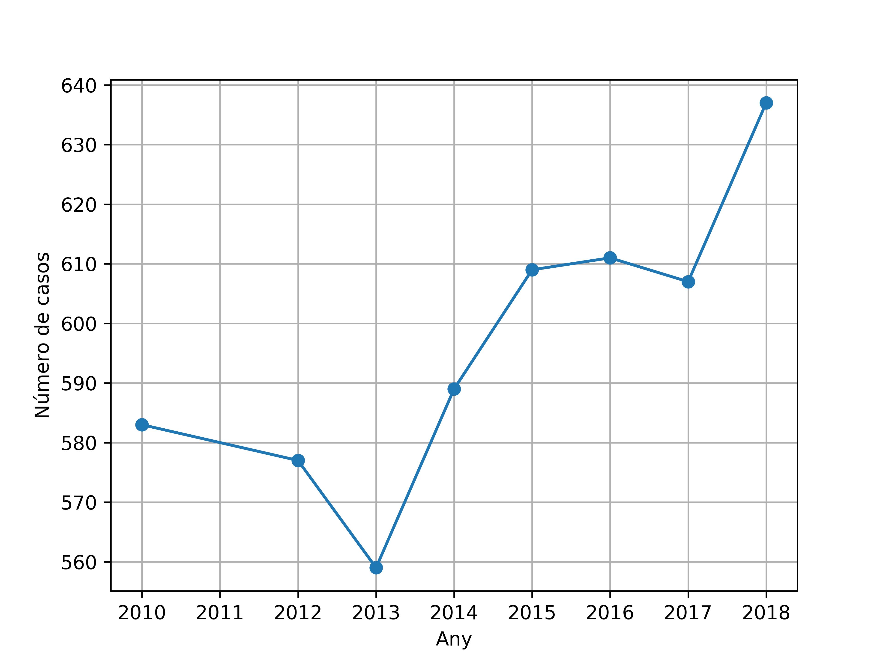

# Open data Barcelona

Data extracted from the [OpenData website](https://opendata-ajuntament.barcelona.cat/data/en/dataset/incidents-gestionats-gub).

## Requirements

Python 3.7.5

## Parse data

First step is to parse the data into some data structure. The following does a
simple analysis of incidents managed by the local police in Barcelona. Specifically,
it generates two files (`data.pkl` and `codes.pkl`) that contain the data and the
corresponding police code descriptions.

    python delitos_bcn.py --action="create_data"

## Plot data for a code

In order to plot the evolution of a particular police code:

    python delitos_bcn.py --action="plot" --code 620

This generate a file `code_{code_number}.png` with the data of that code.

## Find significant changes across all codes

In order to have a better idea of what's going on in the city, you can also
generate data across all codes between the years 2010 and the 2018:

    python delitos_bcn.py --action="find_worst" --output all_codes.csv

You can then analyze that data with your favorite tool, in a [spreadsheet](https://docs.google.com/spreadsheets/d/1-xqdqAbpa1koEJpTd5OjUGZeO_0pZtDLAMO1uHMa7xw/edit#gid=2099034012) for
example. Positive numbers indicate 2018 has more cases than 2010, so an
increasing trend. A negative number indicates that 2018 has more cases than 2010,
so a decreasing trend.

## Examples

- We can combine two different codes (e.g., 20 and 22, for rain and snow, respectively):

- Local police collaborates with other services (e.g., State Police)

- Drugs

- Domestic violence

- Aggressions

